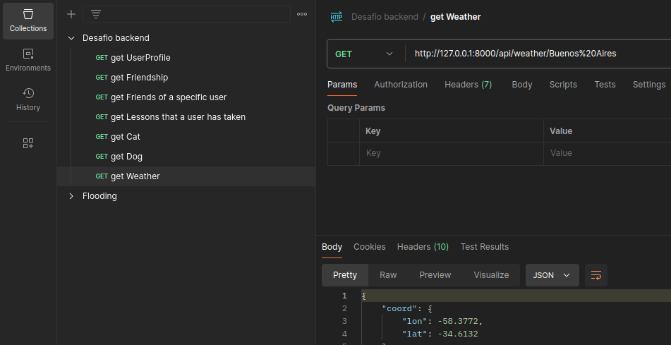

# social-network

Thanks for taking some time to do our backend challenge

To do so, I am proposing you to implement a small system as described below.

Please respond to this message sharing your repo

## Design Friends Lessons System

We want to build a solution that allows a user to know for what courses their friends have taken any lesson. For example:

- Joe has the following friends in the system: Mark, Jody, and Rachel.
- Joe can see through the system that Rachel has taken 3 math lessons and 2 spanish lessons. A user can take more than one lesson on the same topic.

We would like to build an API that exposes endpoints for:

- List all users in the system
- List all friendships registered in the system.
- List of all friends for a specific user.
- List of lessons that a specific user has taken.

Extras for more points:
- Use postgres as your default database
- Traceback all the queries being executed
- Add a Header to each request received. The header must be MyHeader: Hello. You don’t have to send it, you have to add it to the request that is coming
- Can you audit every request in a log? Or even better, in a mongoDB
- Add an async notification to an email(Tip: use celery). Please create a test email for ths and provide the credentials. And how to test it

NOTES:
- You have to do it django >= 3.2 y rest frameworrk >= 3
- Please upload everything to github
- Don't forget to add unit test to Your code
- For extra points please add an UML design of the solution
- Please add a detail readme on how to run your project. And feel free clarify anything You seem fit in the readme
- Intégrate any free API of Your choosing and expose at least one endpoint. https://github.com/public-apis/public-apis

Thanks & good luck!

# solution

## Code Structure

This project is organized into several key components. Below is an overview of the main directories and files, with a focus on the API-related files.

### Social
- `.env` - Environment variables file.
- `asgi.py` - ASGI configuration for asynchronous server gateway interface.
- `settings.py` - Project settings and configurations.
- `urls.py` - URL routing for the project.
- `wsgi.py` - WSGI configuration for web server gateway interface.

### SocialApp
- `api/`
  - `cat_api.py` - API endpoints and logic related to cat data.
  - `dog_api.py` - API endpoints and logic related to dog data.
  - `router.py` - API routing configuration.
  - `serializers.py` - Serialization of data models for API responses.
  - `urls.py` - URL routing for the API endpoints.
  - `viewsets.py` - Viewsets defining the behavior of API endpoints.
  - `weather_api.py` - API endpoints and logic related to weather data.
- `__init__.py` - Package initialization file.
- `admin.py` - Django admin site configuration.
- `apps.py` - Application configuration.
- `models.py` - Data models for the application.
- `signals.py` - Signal handlers for application events.
- `test.py` - Tests for the application.
- `views.py` - Views for handling HTTP requests.

### Project Root
- `manage.py` - Command-line utility for administrative tasks.
- `README.md` - Project documentation.
- `requirements.txt` - List of dependencies required by the project.

## Run the Project

1. Clone the repository:

    ```sh
    git clone git@github.com:agustinsalum/social-network.git
    ```

2. Access the project folder:

    ```sh
    cd social-network
    ```

3. Create and activate a virtual environment named 'venv':

    ```sh
    pip install virtualenv
    virtualenv -p python venv
    source venv/bin/activate
    ```

4. Install the necessary dependencies:

    ```sh
    pip install -r requirements.txt
    ```

5. Create a file named `.env` next to your `settings.py` file:

    ```sh
    touch .env
    ```

6. Copy the following template into your `.env` file and enter your personal credentials:

    ```plaintext
    SECRET_KEY=
    DEBUG=true
    DATABASE_NAME=
    DATABASE_USER=
    DATABASE_PASSWORD=
    DATABASE_HOST=localhost
    DATABASE_PORT=
    OPENWEATHER_API_KEY=
    ```

    Generate a secret key: [Djecrety](https://djecrety.ir/)

7. Perform migrations:

    ```sh
    python manage.py makemigrations
    python manage.py migrate
    ```

8. Run the project:

    ```sh
    python manage.py runserver
    ```

Remember to create the PostgreSQL database before performing the migrations.

## Endpoints of the exercise

- **List all users in the system**
  - **Method**: GET
  - **Endpoint**: `http://127.0.0.1:8000/api/usersProfile/`
  - **Description**: Retrieves a list of all user profiles in the system.

- **List all friendships registered in the system**
  - **Method**: GET
  - **Endpoint**: `http://127.0.0.1:8000/api/friendships/`
  - **Description**: Retrieves a list of all friendships in the system.

- **List all friends of a specific user**
  - **Method**: GET
  - **Endpoint**: `http://127.0.0.1:8000/api/usersProfile/<int:pk>/friends/`
  - **Description**: Retrieves a list of friends for the user with the specified ID (`<int:pk>`).

- **List of lessons taken by a specific user**
  - **Method**: GET
  - **Endpoint**: `http://127.0.0.1:8000/api/takenLessons/<int:pk>/user_lessons/`
  - **Description**: Retrieves a list of lessons that the user with the specified ID (`<int:pk>`) has taken.

- **List of lessons taken by the friends of a specific user**
  - **Method**: GET
  - **Endpoint**: `http://127.0.0.1:8000/api/usersProfile/<int:pk>/friends_lessons/`
  - **Description**: Retrieves a list of lessons taken by the friends of the user with the specified ID (`<int:pk>`).

### Example Use Case

Joe can see through the system that Rachel has taken 3 math lessons and 2 Spanish lessons. To achieve this, Joe can:

1. Retrieve Rachel's profile using the endpoint for listing all users.
2. Find Rachel's ID and use it to fetch her lesson history.
3. Retrieve the list of Rachel's friends and then check their lesson histories.

This API provides the necessary endpoints to manage user profiles, friendships, and lessons within the social network.

## Free endpoints

I have created three endpoints that provide information about cats, dogs, and the weather for any city you specify. The details are as follows:

1. **Cat Endpoint**
   - **Description**: This endpoint returns an image of a cat based on a provided number.
   - **Method**: GET
   - **Endpoint**: `http://127.0.0.1:8000/api/http-cat/<number>/`
   - **Parameters**:
     - `number` (required): The number that determines which cat image to retrieve.
   - **Example**: To get a cat image with number 1, use `http://127.0.0.1:8000/api/http-cat/1/`.

2. **Dog Endpoint**
   - **Description**: This endpoint returns a random image of a dog.
   - **Method**: GET
   - **Endpoint**: `http://127.0.0.1:8000/api/random-dog/`
   - **Parameters**: None
   - **Response**: Provides a URL to a random image of a dog.

3. **Weather Endpoint**
   - **Description**: This endpoint returns the current weather for a specific city. You need to pass the city name as a parameter.
   - **Method**: GET
   - **Endpoint**: `http://127.0.0.1:8000/api/weather/`
   - **Parameters**:
     - `city` (required): The name of the city for which you want to get the weather.
   - **Example**: To get the weather for Buenos Aires, use `http://127.0.0.1:8000/api/weather/Buenos%20Aires`.
   - **Response**: Provides information about the current weather in the specified city, including temperature, humidity, and general conditions.
   - **Note**: To use this endpoint, you need to register at [OpenWeatherMap](https://openweathermap.org/) to obtain an API key. Enter the key in your `.env` file with the variable name `OPENWEATHER_API_KEY`.
   - **Note on Spaces**: In the URL, spaces are represented as `%20`. For example, "Buenos Aires" is encoded as `Buenos%20Aires`.

## Postman



Due to the `permissions.IsAuthenticated` setting, we need to define global variables in **Environments > Globals**. These variables will be named `user` and `pass` and will be added to the **Current value**. This way, they will be read in the **Authorization** section.

## Contact

If you have any questions or suggestions, feel free to contact me via email.
